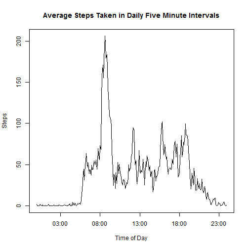

# Reproducible Research: Peer Assessment 1

This is the first project of the on-line Reproducible Research class offered by Johns Hoppkins University through coursera.  This submission was completed by Arnold Cross.  Specific instructions corresponding to the headings below can be found in the README.Rmd file which accompanies this file.

## Loading and preprocessing the data

```r
zipped <- unzip("activity.zip")
act <- read.csv("activity.csv")
dum <- file.remove(zipped)
str(act)
```

```
## 'data.frame':	17568 obs. of  3 variables:
##  $ steps   : int  NA NA NA NA NA NA NA NA NA NA ...
##  $ date    : Factor w/ 61 levels "2012-10-01","2012-10-02",..: 1 1 1 1 1 1 1 1 1 1 ...
##  $ interval: int  0 5 10 15 20 25 30 35 40 45 ...
```
I didn't need any preprocessing.

## What is mean total number of steps taken per day?

```r
stepsPerDay <- tapply(act[,"steps"], act[,"date"], "sum")
hist(stepsPerDay, breaks=20, main="Histogram of Steps Per Day",
                                                        sub="Before imputing data.")
```


From a visual assessment of the historgram, it seems that the subject usually takes about 11,000 steps per day.

```r
cat( "Mean:    ", firstMean   <- mean  (stepsPerDay, na.rm=T), "\n",
     "Median:  ", firstMedian <- median(stepsPerDay, na.rm=T), sep="" )
```

```
## Mean:    10766.19
## Median:  10765
```

## What is the average daily activity pattern?

```r
av <- tapply(act[,"steps"], act[,"interval"], "mean", na.rm=T)
uniqInterval <- unique(act[,"interval"])        # integer vector of interval stamps
inteTime <- paste(uniqInterval %/% 100, ":", uniqInterval %%  100, sep="")
inteTime <- strptime( inteTime, "%H:%M" )       # Posix vector of interval stamps
plot(inteTime, av, type="l",
               main="Average Steps Taken in Daily Five Minute Intervals",
                                                   ylab="Steps", xlab="Time of Day")
```



```r
busyInterval <- format(inteTime[av==max(av)], "%H:%M")
cat( "The most walked time is ", busyInterval, ".\n", sep="" )
```

```
## The most walked time is 08:35.
```

## Imputing missing values
Taking the instructions literally, I looked for rows with NA in any column.

```r
sum(apply( is.na(act), 1, any ))
```

```
## [1] 2304
```
Since the "date" and "interval" columns identify time increments for data collection, they should not have NA's.  The only NA's should be in the measured data, which is the "steps" column.  Checking just that column,

```r
sum( nact <- is.na(act[,"steps"]) )
```

```
## [1] 2304
```
I got the same number of NA's.

The av vector has average values for all time intervals in a day.  Using the logical vector, nact, as a mask and act[,"interval"] as a key, I grab the value from av wherever a "steps" value needs to be imputed.

```r
newact <- act
newact[nact, "steps"] <- av[ as.character(act[,"interval"]) ][nact]
stepsPerDay <- tapply(newact[,"steps"], newact[,"date"], "sum")
hist(stepsPerDay, breaks=20, main="Histogram of Steps Per Day",
                                                        sub="After imputing data.")
```


```r
cat( "Mean:    ", newMean   <- mean  (stepsPerDay, na.rm=T), "\n",
     "Median:  ", newMedian <- median(stepsPerDay, na.rm=T), sep="" )
```

```
## Mean:    10766.19
## Median:  10766.19
```

```r
incOrDec <- c("increase", "decrease")
cat("Imputing the data caused the mean to ", incOrDec[2-(newMean>firstMean)],
    " by ", abs(1-newMean/firstMean)*100, "%,
    and it caused the median to ", incOrDec[2-(newMedian>firstMedian)], " by ",
    abs(1-newMedian/firstMedian)*100, "%.\n\n", sep="")
```

```
## Imputing the data caused the mean to decrease by 0%,
##     and it caused the median to increase by 0.01104207%.
```
The imputed data had no effect on the mean, because I used mean values, and each date either had all NA's or all good values.  That each date either had all NA's or all good values can be seen by counting the date values from rows that do not have NA step values.

```r
table(act[!is.na(act[,"steps"]),"date"])
```

```
## 
## 2012-10-01 2012-10-02 2012-10-03 2012-10-04 2012-10-05 2012-10-06 
##          0        288        288        288        288        288 
## 2012-10-07 2012-10-08 2012-10-09 2012-10-10 2012-10-11 2012-10-12 
##        288          0        288        288        288        288 
## 2012-10-13 2012-10-14 2012-10-15 2012-10-16 2012-10-17 2012-10-18 
##        288        288        288        288        288        288 
## 2012-10-19 2012-10-20 2012-10-21 2012-10-22 2012-10-23 2012-10-24 
##        288        288        288        288        288        288 
## 2012-10-25 2012-10-26 2012-10-27 2012-10-28 2012-10-29 2012-10-30 
##        288        288        288        288        288        288 
## 2012-10-31 2012-11-01 2012-11-02 2012-11-03 2012-11-04 2012-11-05 
##        288          0        288        288          0        288 
## 2012-11-06 2012-11-07 2012-11-08 2012-11-09 2012-11-10 2012-11-11 
##        288        288        288          0          0        288 
## 2012-11-12 2012-11-13 2012-11-14 2012-11-15 2012-11-16 2012-11-17 
##        288        288          0        288        288        288 
## 2012-11-18 2012-11-19 2012-11-20 2012-11-21 2012-11-22 2012-11-23 
##        288        288        288        288        288        288 
## 2012-11-24 2012-11-25 2012-11-26 2012-11-27 2012-11-28 2012-11-29 
##        288        288        288        288        288        288 
## 2012-11-30 
##          0
```
We see that every date level has either zero counts or 288 counts.

The imputed data caused the mean to become the median.  From the above observation, we know that some dates took on the mean value as their total steps value.  That one of those dates ended up as the median date indicates that the data was well balanced around its mean.

## Are there differences in activity patterns between weekdays and weekends?

```r
newact["ww"] <- factor(ifelse(
                   substr(weekdays( as.POSIXct(newact[,"date"]) ), 1, 1) == "S",
                   "weekend", "weekday" ))
wav <- tapply(newact[,"steps"], newact[,c("interval","ww")], "mean") #2 dim arr
par( mfrow=c(2,1) )
plot(inteTime, wav[,"weekend"], type="l", main="Weekend",
                                                  ylab="Steps", xlab="Time of Day")
plot(inteTime, wav[,"weekday"], type="l", main="Weekday",
                                                  ylab="Steps", xlab="Time of Day")
```


To answer the question, the following plot shows the differences between weekend steps and weekday steps, with positive values representing increased activity on the weekends.

```r
plot(inteTime, wav[,"weekend"]-wav[,"weekday"], type="l",
        main = "Difference Between Weekend and Weekday", ylab="Steps",
                                                         xlab="Time of Day")
```


